# Kings County Housing Bake-off

For the Kings County Housing Bake-off, we were tasked with the goal to predict houses prices given a dataset of information. This could be beneficial in a business setting for many reasons. For example, if a customer wanted to buy a house, they could be able to put in some relevant data about the location, square footage, bedroom, etc. And be able to get an estimate of what the house is worth. On the other side if someone is selling a house, they would be able to do put in similar data to see what a fair price would be. It is also good to get this practice because similar modeling processes could be used in many different aspects of business. For example, a business professional could use a similar modeling process to valuate a business, or stock prices. 

  
- **Exploratory Data Analysis (EDA):** 

To start, I began performing EDA (Exploratory Data Analysis). I first want to look at the statistical features of our target variable “Price”. A simple distplot, which is a histogram with a line to help show distribution showed that our price data was positively skewed, which is evidence we could be dealing with upper range outliers, or large than usual house prices. I calculated the inter-quartile upper range and the inter-quartile extreme upper range (10xIQR). The values outside 10 times the interquartile range I convert to the inter-quartile upper range. 

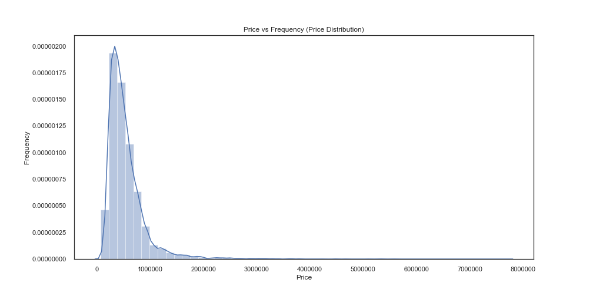

Also, a “log_price” variable could also work better in our model because it is more normally distributed. 

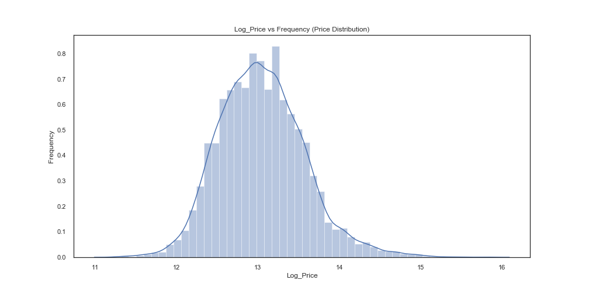

Next I started to look at the independent variables starting with “sqft_living”. I checked for more extreme values but decided against converting the values because they were authentic values. 

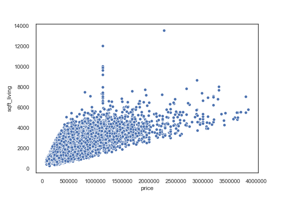

Then I wanted to get an idea of Multicollinearity in our dataset, so I used a Pearson Correlation Matrix. This was a useful visualization that made it easy to check multicollinearity as my dataset evolved. Something that stood out right away was the correlation between all of the sqft columns (sqft_living, sqft_lot, sqft_lot15, sqft_above, sqft_basement, sqft_living15). I used a VIF calculated and a Pair plot visualization to further investigate. 

I decided that it would be sufficient to use sqft_living as my variable, convert sqft_basement into a binary (Basement and No Basement) column, and disregard the rest. 

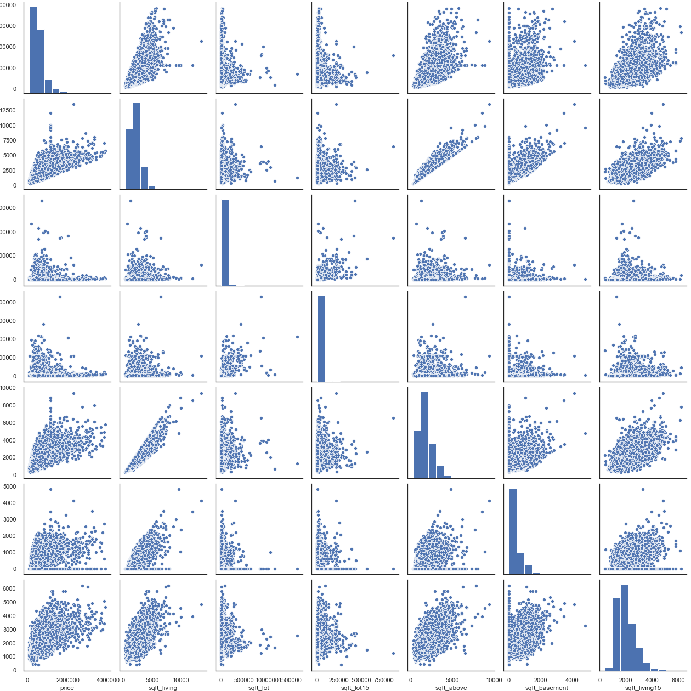

Next I just went through some more basic EDA to get a better understanding of the data. Using a Boxplot, I was able better see the Number of Bedrooms effect on Price. I was able to get more significant result by binning bedrooms into 4 groups. Also, there were two outliers of 11 and 33 bedrooms, which I converted to the mean. 

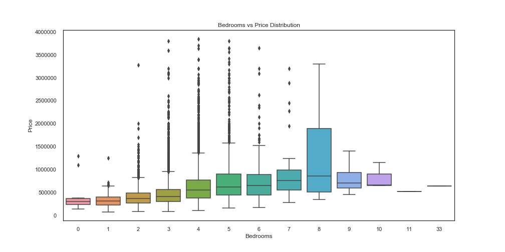

I then when went on to visualize Waterfront vs Price in two boxplots, which showed house with waterfront seem to be more expensive. And Basement vs Price the same way, which showed not much of a different between the mean price of houses with and without basements. 

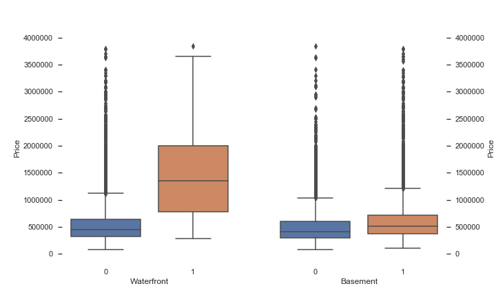

Similarly, I used a boxplot to visualize Condition, which values ranged from 1 to 5. The boxplots showed a not very significant change in mean prices between house condition. Leading me to believe it is not a significant variable

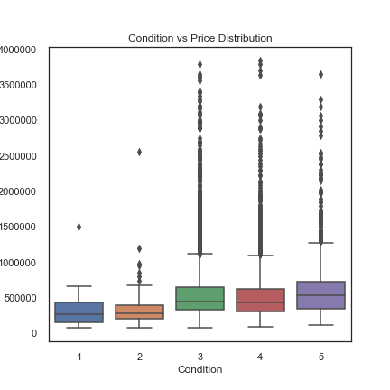

Next I went on to Grade vs Price which is valued on a range to 13. The boxplot showed not a great deal of change in the early values but a significant change as the grade gets better. This being the case, I decided to bin the House Grades into 3 bin, 1 to 9 “Low Grade”, 10 and 11 “High Grade”, and 12 and 13 “High Grade”. I used an OLS model to check to see how my R-Squared and P-Values were affected by these changes. 

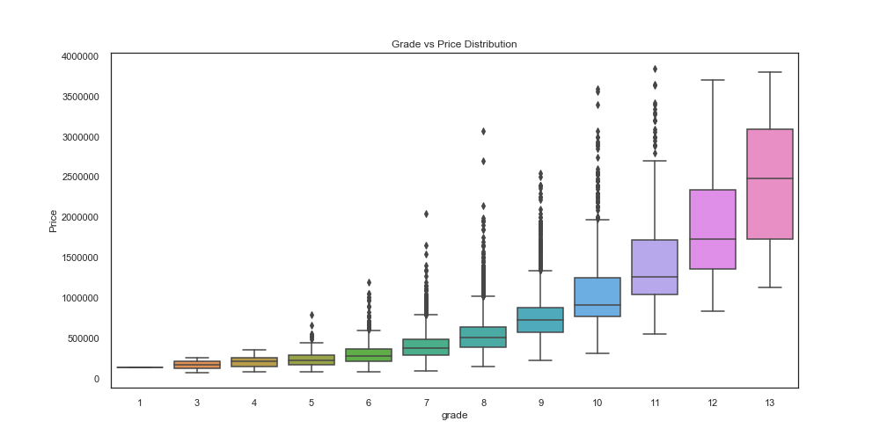

- **Feature Engineering:**  

I then began with Feature Engineering. First, I feature engineered a Bath per Bedroom value. I plotted Bath_per_Bed vs Price and did not come to any visual conclusion. After a new featured was engineered I would use the correlation matrix, a VIF calculator, and an OLS to see how the new variable effects the data.

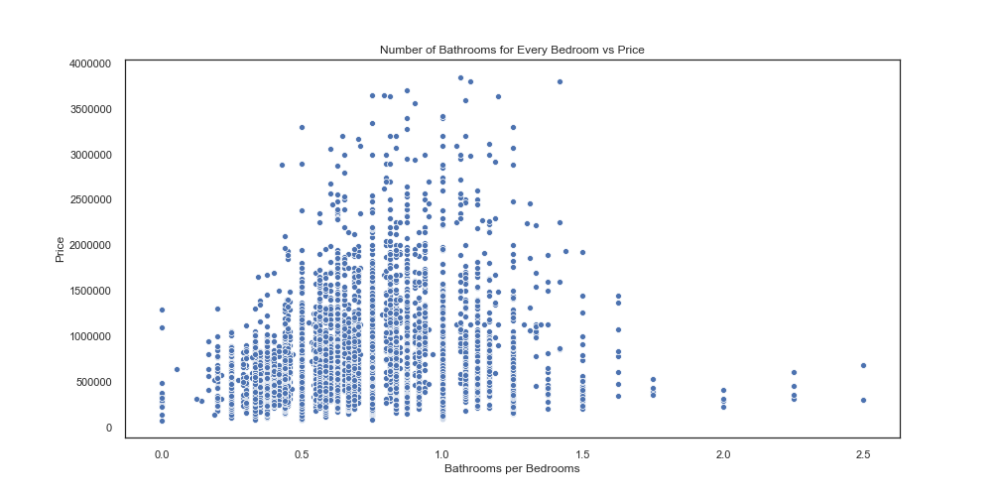

I also decided to make some of my variable’s binary. Liked mentions earlier, I changed the sqft_basement feature to show if the house has a basement or not. I did a similar conversion to the ‘floors’ feature. Our model was not responding well to that feature, so I decided to make it into a “One Story House” or “Multi Story House”.  Similarly, I made the condition feature “Bad Condition” and “Good Condition”. 

Another successful way to feature engineer was through binning. For the features “Grade”, “Zip Code Price Level”, and “Years Old” instead of having a lot of unique discrete variables for each feature. 

I also used the Date Sold column to engineer a column that shows the season the house was sold. Which did not come out very valuable. 

- **Statistical Tests:** 
The first statistical test I used was a Two Sample T-Test, to text the mean prices of the Year a house sold. We only had two unique values for year sold (2014, 2015) so a Two Sample T-Test was perfect. 

   Our Null Hypothesis is that the mean prices of houses sold in 2014 and 2014 are the same 

   Our Alternative Hypothesis was that they are different
  

   With a t-statistic of 0.307 and a p-value of .759 we can accept the Null hypothesis. Proving the year does not make a   significant different in the mean house prices. 
     
     
     
Next I went on to an Anova test. Here I tried to determine if the season the house was sold matter in the price. 

   My Null Hypothesis is that the season does not affect the price 

   My Alternative Hypothesis is that season does have an effect on price

   With a f-statistic of 6.882 and a P-value of 0.000125 we reject the null hypothesis proving that the season sold does make a difference. 
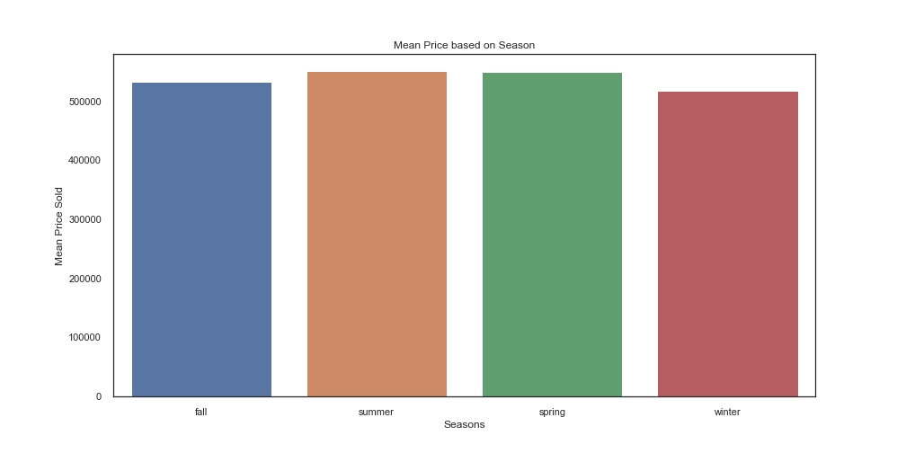

Last I did another Anova test to see if the Binned Zip code based on housing prices has an effect on the Sqft of the House.

My Null Hypothesis is that the zip code has no effect on the size of the house.

My Alternative Hypothesis is that the zip code does have an effect on the size of the house.

With a f-statistic of 523.56 and a p-value of 0.0 we can reject the null hypothesis. Leading us to believe that there is a statistical different inhouse size by zip code 

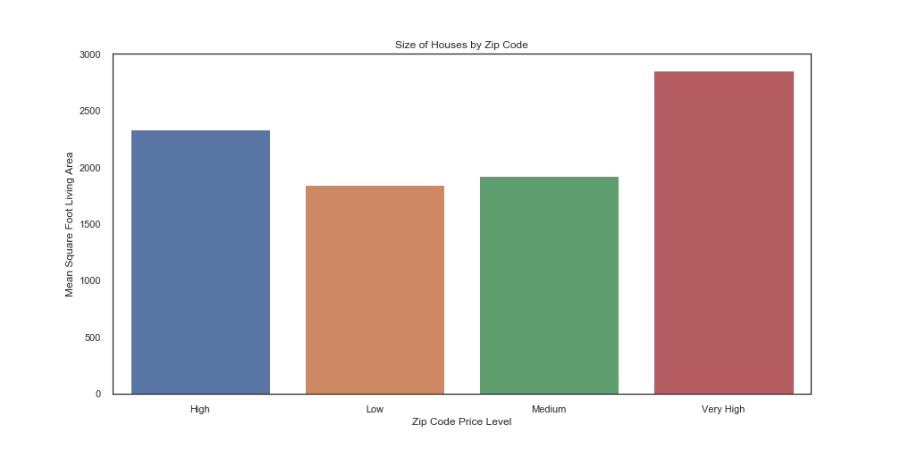     
     
 
 **Feature Selection:** 
 I used a lot of different methods for Feature Selection. To start I was able to code a VIF factor with help me decide with variable were having negative effect on the model. I also used the Person Correlation Matrix to help see if my features were multicollinear. Then I would use a simple OLS Multiple Linear model to help see which features are helping and hurting our predictions; based on p-values, r-squared value, t-value, etc. After I was fine with those tests, I would move into Sklearn linear modeling to further test my data. I used the Polynomial Features function to transform my dataset. I also used Recursive Feature Elimination to further examine my data. And KBest to get my most useful features 

- **Model Interpretation:** 
After going through each different process, I would check to see the R-Squared, Training Root Mean Square Error, Test Root Mean Squared Error. I would also check my Residual Plot help visually see where my model errors lie. 

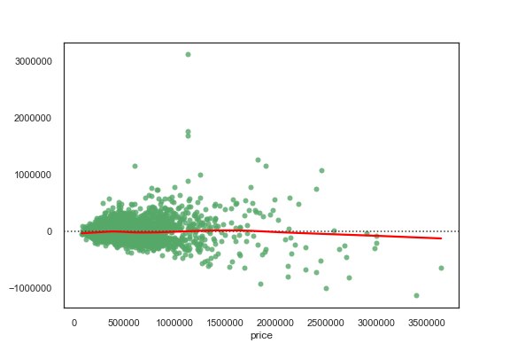 

In the end I decided to use a Polynomial 2-degree dataset and ran a Select Kbest function to get a list of my 20 most useful features when predicting price. While the R-squared value was .74, determining that 74% of my model variance can be explained. And my Training RMSE was $173,615 and Test RMSE $185,258. I still was unable to perform confidently on the Holdout Data which is concerning. I will need to go back a troubleshoot to see where my error lie. 

